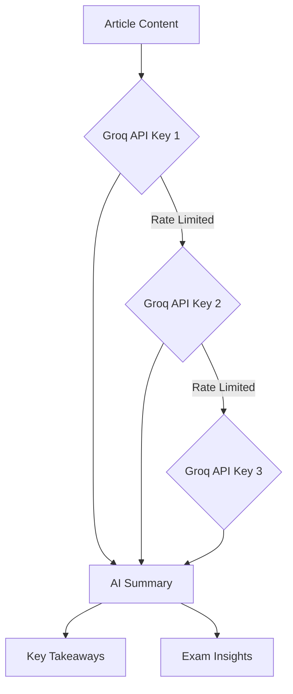

# AI News Summarizer App 2.0

<div align="center">


[](https://reactjs.org/)
[](https://www.typescriptlang.org/)
[](https://vitejs.dev/)
[](https://tailwindcss.com/)

**Transform news into knowledge. Your intelligent companion for staying informed with AI-powered analysis and multi-language support.**

[Features](#features) • [Quick Start](#quick-start) • [Setup](#setup) • [Screenshots](#screenshots) • [Contributing](#contributing)

</div>

---

## Features

### Core Features
- **AI-Powered Analysis** - Groq API integration with smart key rotation
- **11 Language Support** - English, Hindi, Tamil, Bengali, Telugu, Marathi, Gujarati, Kannada, Malayalam, Punjabi, Urdu
- **Real-time RSS Feeds** - 8+ major Indian news sources with CORS proxy fallback
- **PDF Processing** - Upload, analyze, and summarize PDF documents
- **Secure Authentication** - One device, one account policy with password protection
- **Local Database** - IndexedDB with user isolation and data persistence

### User Experience
- **3 Theme Modes** - Light, Dark, and Newspaper themes
- **Fully Responsive** - Mobile, tablet, and desktop optimized
- **Progressive Loading** - Real-time article updates as they load
- **Smart Bookmarking** - Save and organize your favorite articles
- **Advanced Search** - Filter by topics, date ranges, and keywords
- **Analytics Dashboard** - Track your reading habits and statistics

### Security & Privacy
- **Password Protection** - Secure account creation and login
- **User Isolation** - Complete data separation between accounts
- **Account Management** - Delete account with all associated data
- **Local Storage** - All data stored locally on your device

---

## Quick Start

### Prerequisites
- **Node.js** 18+ and npm
- **Groq API Keys** (free tier available)

### Installation

```bash
# Clone the repository
git clone https://github.com/your-username/ai-news-summarizer-2.0.git
cd "AI News Summarizer App 2.0"

# Install dependencies
npm install

# Configure environment variables
cp .env.example .env
# Add your Groq API keys to .env

# Start development server
npm run dev
```

Visit `http://localhost:3000` and start exploring!

---

## Setup

### API Configuration

#### Groq API (Required for AI Analysis)
1. Visit [console.groq.com](https://console.groq.com)
2. Create a free account
3. Generate 3 API keys for rotation
4. Add to your `.env` file:

```env
VITE_GROQ_API_KEY=your_groq_key_1
VITE_GROQ_API_KEY_2=your_groq_key_2
VITE_GROQ_API_KEY_3=your_groq_key_3
```

### News Sources (No Setup Required)

The app automatically fetches from these trusted sources:
- **Times of India** (TOI)
- **The Hindu**
- **Indian Express**
- **Hindustan Times**
- **NDTV**
- **LiveMint**
- **The Wire**
- **India Today**

No API keys needed • No rate limits • Real-time updates

---

## Project Structure

```
AI News Summarizer App 2.0/
├── src/
│   ├── components/          # React components
│   │   ├── ui/             # Reusable UI components
│   │   ├── Dashboard.tsx   # Analytics dashboard
│   │   ├── NewsAggregator.tsx # News fetching & display
│   │   ├── PDFProcessor.tsx   # PDF upload & analysis
│   │   ├── UserAuth.tsx       # Authentication system
│   │   └── UserDropdown.tsx   # User menu & settings
│   ├── utils/              # Utility functions
│   │   ├── rssApi.ts       # RSS feed processing
│   │   ├── groqApi.ts      # AI analysis integration
│   │   ├── database.ts     # IndexedDB operations
│   │   ├── userManager.ts  # User management
│   │   └── pdfParser.ts    # PDF text extraction
│   ├── App.tsx             # Main application
│   └── main.tsx            # Entry point
├── package.json            # Dependencies
├── vite.config.ts          # Vite configuration
└── README.md               # Documentation
```

---

## How It Works

### News Processing Pipeline


### AI Analysis Flow


---

## Tech Stack

| Category | Technology | Version |
|----------|-----------|---------|
| **Frontend** | React + TypeScript | 18.3.1 + 5.0 |
| **Build Tool** | Vite | 6.3.5 |
| **Styling** | Tailwind CSS | 3.4.0 |
| **UI Components** | Radix UI + Lucide Icons | Latest |
| **Database** | IndexedDB (Dexie) | 4.0+ |
| **PDF Processing** | PDF.js | 4.9.155 |
| **AI Analysis** | Groq API (Llama) | Latest |
| **State Management** | React Hooks | Built-in |
| **Notifications** | Sonner | Latest |

---

## Key Features Deep Dive

### Authentication System
- **One Device, One Account** policy
- **Password-protected** accounts
- **Secure user isolation** with separate data storage
- **Account deletion** with complete data cleanup

### News Aggregation
- **Real-time RSS feeds** from 8+ trusted sources
- **3-tier CORS proxy** fallback system
- **Smart duplicate detection** using content similarity
- **Progressive loading** with live updates
- **Date range filtering** (24h, week, month, custom)

### AI Analysis
- **Groq API integration** with 3-key rotation
- **Lightweight summaries** with key takeaways
- **Exam-relevant insights** extraction
- **Multi-language support** for analysis
- **Rate limit handling** with automatic failover

### Data Management
- **IndexedDB storage** with user isolation
- **Bookmark system** for articles and PDFs
- **Search history** tracking
- **Export functionality** (JSON, PDF)
- **Database statistics** and cleanup tools

---

## Language Support

| Language | Code | Native Name |
|----------|------|-------------|
| English | `en` | English |
| Hindi | `hi` | हिंदी |
| Tamil | `ta` | தமிழ் |
| Bengali | `bn` | বাংলা |
| Telugu | `te` | తెలుగు |
| Marathi | `mr` | मराठी |
| Gujarati | `gu` | ગુજરાતી |
| Kannada | `kn` | ಕನ್ನಡ |
| Malayalam | `ml` | മലയാളം |
| Punjabi | `pa` | ਪੰਜਾਬੀ |
| Urdu | `ur` | اردو |

---

## Topic Categories

**Polity** • **Economy** • **Environment** • **International Relations** • **Science & Tech** • **Society** • **History** • **Geography**

---

## Performance Features

- **Vite** for lightning-fast development
- **Progressive loading** with real-time updates
- **Efficient caching** with IndexedDB
- **CSS-in-JS** with Tailwind for optimal performance
- **Mobile-first** responsive design
- **Debounced search** for smooth user experience

---

## Privacy & Security

- **Local-first** - All data stored on your device
- **Password protection** for account access
- **User isolation** - Complete data separation
- **Right to deletion** - Remove all data anytime
- **No tracking** - Your privacy is protected
- **Secure API calls** with key rotation

---

## Themes

### Light Mode
Clean, modern interface perfect for daytime reading

### Dark Mode  
Easy on the eyes for night-time news consumption

### Newspaper Mode
Classic newspaper aesthetic for traditional readers

---

## Mobile Experience

- **Touch-optimized** interface
- **Pull-to-refresh** functionality
- **Mobile dashboard** with swipe gestures
- **Collapsible menu** for easy navigation
- **Fast loading** on mobile networks

---

## Development

### Available Scripts

```bash
# Development
npm run dev          # Start dev server (http://localhost:3000)

# Production
npm run build        # Build for production
npm run preview      # Preview production build

# Linting & Formatting
npm run lint         # Run ESLint
npm run format       # Format with Prettier
```

### Development Guidelines

1. **Code Style** - Follow TypeScript best practices
2. **Components** - Use functional components with hooks
3. **Styling** - Tailwind CSS utility classes
4. **State** - React hooks for local state, IndexedDB for persistence
5. **API** - Proper error handling and loading states

---

## Contributing

We welcome contributions! Here's how you can help:

### Bug Reports
Found a bug? [Open an issue](https://github.com/your-repo/issues) with:
- Clear description
- Steps to reproduce
- Expected vs actual behavior
- Screenshots if applicable

### Feature Requests
Have an idea? [Start a discussion](https://github.com/your-repo/discussions) about:
- Feature description
- Use case and benefits
- Implementation suggestions

### Pull Requests
Ready to contribute code?
1. Fork the repository
2. Create a feature branch (`git checkout -b feature/amazing-feature`)
3. Commit your changes (`git commit -m 'Add amazing feature'`)
4. Push to the branch (`git push origin feature/amazing-feature`)
5. Open a Pull Request

---

## Roadmap

### Version 2.1 (Coming Soon)
- Real-time notifications for breaking news
- Advanced analytics with reading patterns
- Custom themes and personalization
- Social sharing integration

### Version 2.2 (Future)
- Multi-device sync with cloud storage
- Voice narration for articles
- Mobile app (React Native)
- Advanced AI with GPT-4 integration

---

## Acknowledgments

### Design Inspiration
- Original Figma design from [Figma Community](https://www.figma.com/design/gyTvphSj7O4ZRiB8SnwwDb/AI-News-Summarizer-App)

### Technologies
- **Groq** for lightning-fast AI inference
- **Radix UI** for accessible components
- **Lucide** for beautiful icons
- **Mozilla PDF.js** for PDF processing
- **Dexie** for IndexedDB management

### News Sources
Special thanks to all the news organizations providing RSS feeds:
- Times of India, The Hindu, Indian Express, NDTV, and others

---

## License

This project is licensed under the **MIT License** - see the [LICENSE](LICENSE) file for details.

---

## Support

### Having Issues?

| Issue Type | Solution |
|------------|----------|
| **Build Errors** | Run `npm install` and check Node.js version |
| **API Issues** | Verify Groq API keys in `.env` file |
| **News Not Loading** | Check internet connection (RSS feeds are free!) |
| **CORS Issues** | App automatically tries 3 different proxies |
| **PDF Processing** | Ensure PDF.js worker version matches (4.9.155) |

### Get Help
- **Email**: support@ainewsanalyzer.com
- **Discord**: [Join our community](https://discord.gg/ainews)
- **Twitter**: [@AINewsAnalyzer](https://twitter.com/ainewsanalyzer)

---

<div align="center">

**Made with ❤️ for staying informed in the digital age**

[⬆️ Back to Top](#ai-news-summarizer-app-20)

</div>